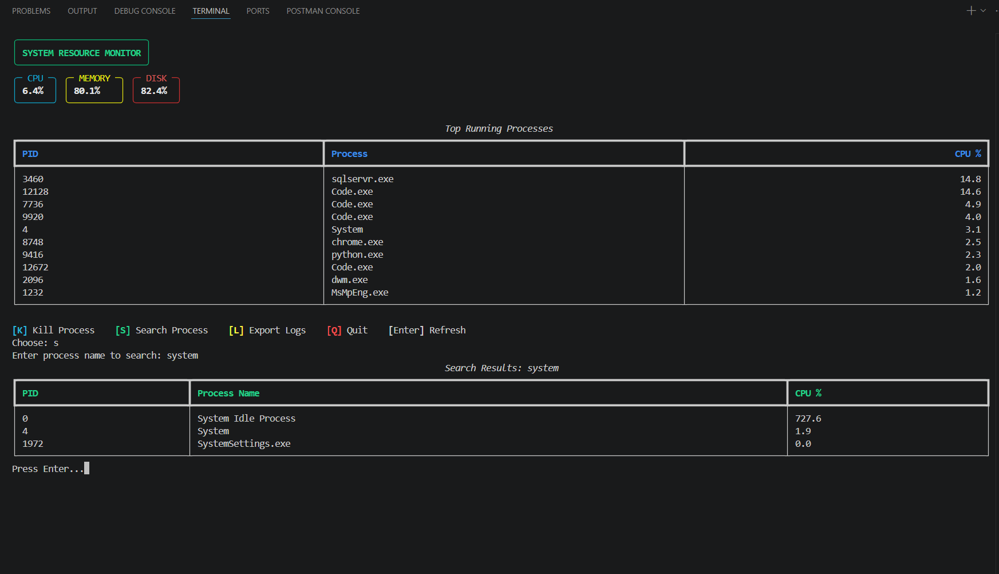

# Linux System Resource Monitor CLI

A terminal-based system monitoring tool built with Python that displays real-time system resource usage including CPU, memory, disk usage, and running processes.

This project is inspired by Linux tools like `top` and `htop`, but built from scratch using Python.

---

## Preview



## Features

- Real-time CPU usage monitoring
- Memory (RAM) usage monitoring
- Disk usage monitoring
- Display top running processes
- Search process by name
- Kill process by PID
- Export system usage logs to file
- Refresh terminal dashboard interactively
- Colorful terminal UI using Rich

---

## Tech Stack

- Python
- psutil
- Rich

---

## Project Structure

```bash
linux-resource-monitor/
│
├── monitor.py        # Main application
├── system_log.txt    # Exported log history
├── README.md
├── .gitignore
└── venv/
```

---

## Installation

### 1. Clone repository

```bash
git clone <your-repo-url>
cd linux-resource-monitor
```

---

### 2. Create virtual environment

### Windows

```bash
python -m venv venv
```

Activate:

```bash
.\venv\Scripts\Activate.ps1
```

---

### Linux / macOS

```bash
python3 -m venv venv
source venv/bin/activate
```

---

### 3. Install dependencies

```bash
pip install psutil rich
```

---

## Run the project

```bash
python monitor.py
```

---

## Controls

| Key   |                 Action |
| ----- | ---------------------: |
| Enter |      Refresh dashboard |
| K     | Kill process using PID |
| S     | Search process by name |
| L     |    Export logs to file |
| Q     |       Quit application |

---

## Export Logs

When `L` is selected, system stats are saved inside:

```bash
system_log.txt
```

Example:

```text
2026-05-28 11:20:18 | CPU: 15.3% | Memory: 62.8% | Disk: 82.4%
```

---

## Learning Goals

This project helped practice:

- Python scripting
- Working with system processes
- Terminal-based UI development
- File handling
- Process management
- Resource monitoring
- Building CLI applications

---

## Future Improvements

Possible upgrades:

- Live auto-refresh mode
- CPU usage graphs
- Network monitoring
- Save logs as CSV
- Filter processes by CPU usage
- Sort by memory consumption

---

## Author

**Pankaj Joshi**

Built as a learning project for Python, Linux utilities, and CLI development.
